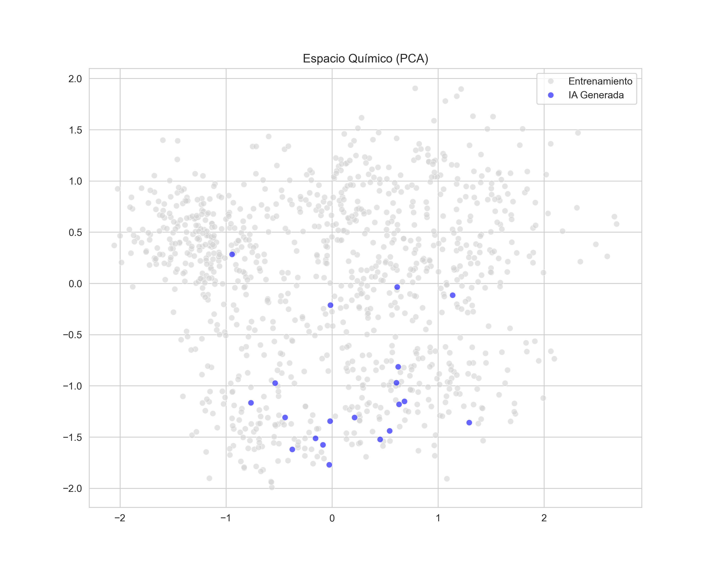

# Eco-Sieve VAE: Generación de Moléculas Lead-like



##  Descripción
Eco-Sieve es un modelo generativo basado en **Variational Autoencoders (VAE)** diseñado para el descubrimiento de fármacos *de novo*. El modelo prioriza la generación de estructuras **"Lead-like"** (bajo peso molecular, alta eficiencia de ligando), optimizando el espacio químico para fases tempranas de desarrollo farmacéutico.

##  Resultados Clave
* **Novedad:** Índice de Tanimoto promedio de **0.255** (Alta originalidad, cero plagio).
* **Calidad:** QED promedio superior al dataset de entrenamiento.
* **Eficiencia:** Desplazamiento intencional hacia pesos moleculares bajos (~180 Da) para facilitar la optimización posterior.

##  Estructura del Proyecto
* `src/`: Código fuente del modelo (PyTorch) y pipelines.
* `results/`: Gráficos de análisis (PCA, Distribuciones) y candidatos generados.
* `data/`: Dataset de entrenamiento (SMILES).

##  Instalación
```bash
git clone [https://github.com/bvasquezp/Eco-Sieve.git](https://github.com/bvasquezp/Eco-Sieve.git)
cd Eco-Sieve
pip install -r requirements.txt
